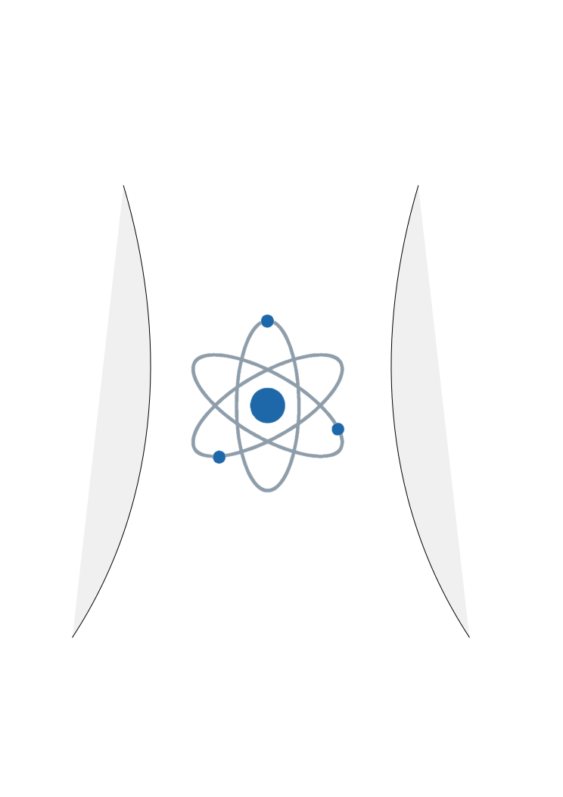

# Reactor

¡Bienvenido a la documentación oficial de [**Reactor**](https://github.com/GHRMMDDTT/Reactor)!

<p align="center">
    
    
</p>

## 🧠 Filosofía y Enfoque

Reactor no es solo otra librería de componentes; es un cambio de paradigma diseñado para situaciones donde el modelo puramente declarativo de React se vuelve verboso o ineficiente.

### El Paradigma Híbrido
React brilla por su naturaleza declarativa ("dime qué quieres, no cómo hacerlo"). Sin embargo, para interacciones complejas, animaciones o componentes de alto rendimiento, a veces necesitas decir *exactamente* "cómo hacerlo".

Reactor fusiona ambos mundos:
1.  **Declarativo para la Estructura**: Defines tu UI con JSX, igual que siempre.
2.  **Imperativo para el Comportamiento**: Usas métodos directos (`setWidth`, `focus`, `animate`) para controlar los componentes en respuesta a eventos.

### React vs. Reactor

**En React Tradicional:**
Para cambiar el ancho de un div al hacer clic, necesitas:
1.  Crear un estado (`useState`) en el componente padre.
2.  Pasar el valor del estado como prop al hijo.
3.  Pasar una función `setWidth` al hijo o manejar el evento en el padre.
4.  **Resultado**: El padre se re-renderiza, el hijo se re-renderiza.

**En Reactor:**
1.  Obtienes la instancia del componente (`self`) en el evento.
2.  Llamas a `self.setWidth()`.
3.  **Resultado**: Solo el widget `View` interno actualiza su estilo. El padre **no** se re-renderiza.

### Rendimiento y Encapsulamiento
Cada widget en Reactor (como `View`) es un "agente autónomo". Mantiene su propio estado interno para propiedades visuales (tamaño, color, posición). Esto significa que las actualizaciones son:
*   **Atómicas**: Solo cambia lo que necesita cambiar.
*   **Rápidas**: Evitan el ciclo de reconciliación de React para cambios puramente estéticos.
*   **Limpias**: Tu lógica de negocio no se ensucia con estados de UI triviales (como `isHovered`, `currentWidth`).

## 🚀 Instalación

Para comenzar a utilizar Reactor en tu proyecto, sigue estos pasos:

1.  **Clona el repositorio:**

    ```bash
    git clone https://github.com/GHRMMDDTT/Reactor.git
    cd Reactor
    ```

2.  **Instala las dependencias:**

    ```bash
    npm install
    ```

3.  **Inicia el servidor de desarrollo:**

    ```bash
    npm start
    ```

    La aplicación se abrirá en [http://localhost:3000](http://localhost:3000).

## ✨ Características Principales

*   **Widget View**: El bloque de construcción fundamental. Un componente `div` supervitaminado con manejo de estado interno para dimensiones, colores, espaciado y más.
*   **API Imperativa**: Olvídate de pasar props para cada pequeño cambio. Obtén una referencia al componente y llama a métodos como `self.setWidth()`, `self.setBackgroundColor()` o `self.setPadding()` directamente desde tus manejadores de eventos.
*   **Tipado CSS Robusto**: Reactor incluye un sistema de tipos avanzado (`CSSColor`, `CSSSizeNumeric`) que valida tus valores de estilo en tiempo de compilación, previniendo errores comunes de CSS.
*   **Sistema de Eventos Reactivo**: Callbacks integrados como `onPressed`, `onReleased`, `onWidthChanged`, `onFocusChanged` que te dan control total sobre el ciclo de vida de interacción del usuario.

## 💡 Ejemplo de Uso

Aquí tienes un ejemplo de cómo crear un componente interactivo que cambia de tamaño al ser presionado, demostrando la API imperativa de Reactor:

```tsx
import React from 'react';
import { View } from './reactor/widgets/view';

export default function App() {
    return (
        <View
            // Propiedades iniciales
            width='100px'
            height='100px'
            backgroundColor='red'
            
            // Manejo de eventos con acceso a la instancia 'self'
            onPressed={(self) => {
                console.log('¡Presionado!');
                // Modificación imperativa del estado
                self.setWidth('250px');
                self.setBackgroundColor('blue');
            }}
            
            onReleased={(self) => {
                console.log('Soltado');
                // Restaurar estado
                self.setWidth('100px');
                self.setBackgroundColor('red');
            }}
            
            // Escuchar cambios en propiedades específicas
            onWidthChanged={{
                onWidthChanged: (oldWidth, newWidth) => {
                    console.log(`Ancho cambiado de ${oldWidth} a ${newWidth}`);
                }
            }}
        />
    );
}
```

### Propiedades de `View`

El widget `View` acepta una variedad de propiedades para controlar su apariencia y comportamiento:

| Propiedad | Tipo | Descripción |
| :--- | :--- | :--- |
| `width` | `CSSSizeNumeric` | Ancho del componente (ej. '100px', '50%'). |
| `height` | `CSSSizeNumeric` | Alto del componente. |
| `backgroundColor` | `CSSColor` | Color de fondo (soporta hex, rgb, hsl, nombres). |
| `padding` | `CSSSizeNumeric` | Relleno interno. |
| `margin` | `CSSSizeNumeric` | Margen externo. |
| `classed` | `CSS` | Objeto para aplicar clases y estilos avanzados. |

## 📂 Estructura del Proyecto

*   `src/reactor/widgets`: Contiene los componentes base como `View`.
*   `src/reactor/components`: Definiciones de tipos y utilidades para el sistema de estilos (`css-types`, `css-types-elements`).
*   `src/App.tsx`: Punto de entrada de la aplicación de ejemplo.

## 🤝 Contribución

¡Las contribuciones son bienvenidas! Si tienes ideas para nuevos widgets, mejoras en la API o correcciones de errores, no dudes en abrir un *issue* o enviar un *pull request*.

## 📄 Licencia

Este proyecto está bajo la licencia MIT. Consulta el archivo `LICENSE` para más detalles.
